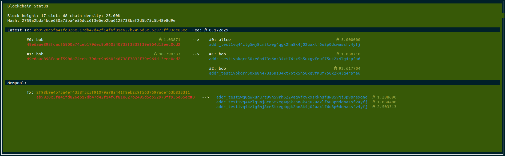
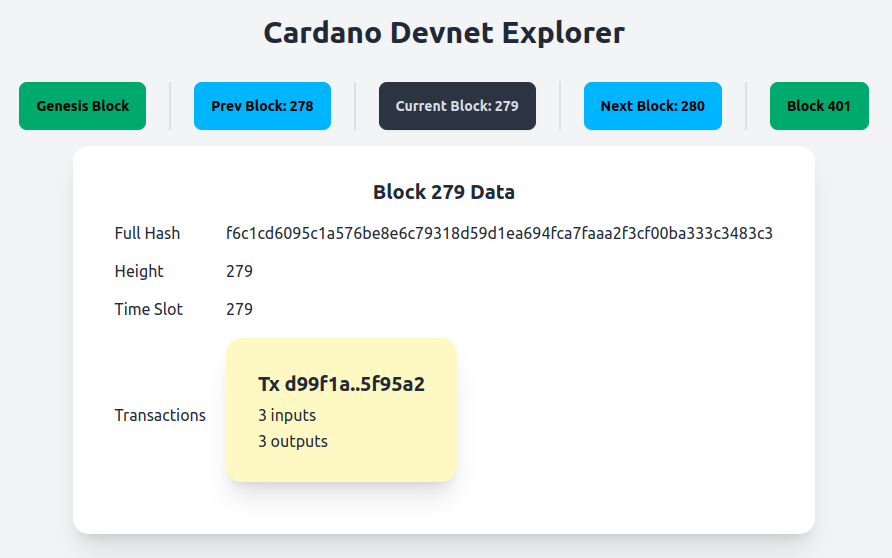
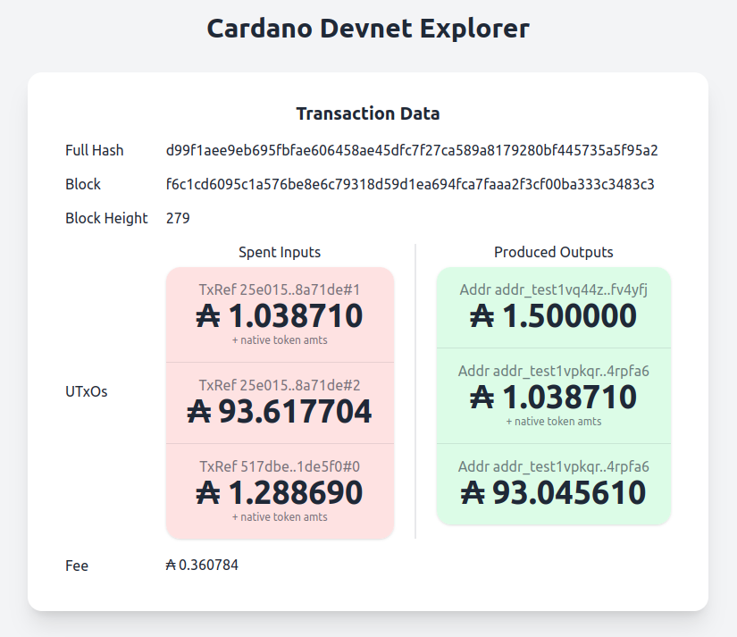
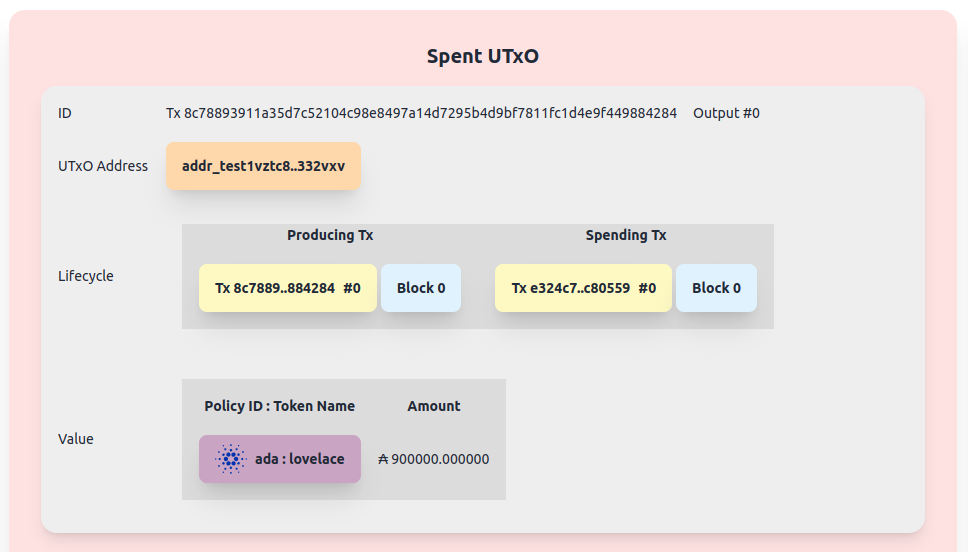
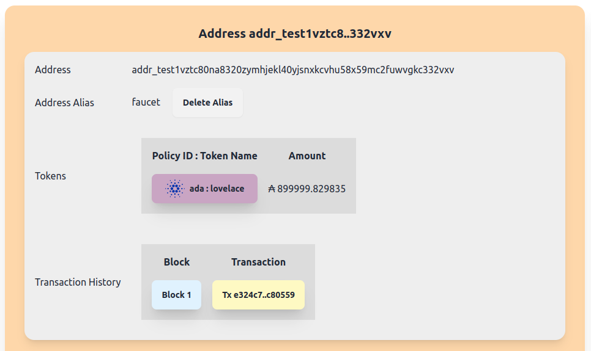
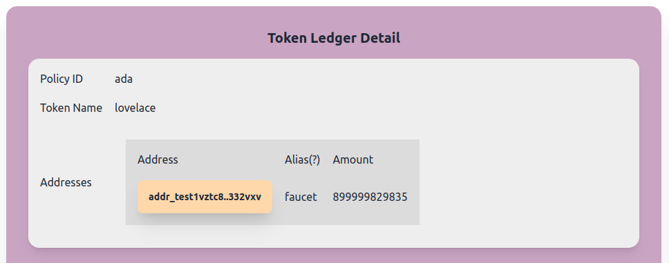

As of the 2024 Chang hard fork, **Dracula DAO** is a sponsor of cardano-devnet development. To support this project, consider staking at [Vampyre Fund SPO](https://vampyre.fund), a single pool operator on the Cardano network with reliable uptime since 2020.

# Cardano Devnet

This repository enables anyone to create a completely local cardano development network that runs only on the development machine, with average block times that can be specified as a number of seconds, assignable from the command line.  This is useful if you want to experiment privately and locally, with an unlimited amount of tokens, without requiring network connectivity, and be able to discard the chain state once you're done with it.

## Installation

1. This project uses maintained docker containers to run the various components (cardano-node, ogmios) automatically.  Install [docker](https://docs.docker.com/engine/install/) and ensure it works for the user you want to run the devnet as (avoid running docker as root). Make sure you have the latest version with the "docker compose" command.

2. Clone the repo and allow direnv ([direnv](https://direnv.net/) must be installed on your system).

```
$ git clone https://github.com/Dracula-DAO/cardano-devnet
$ cd cardano-devnet
```

3. Install dependencies

```
$ git submodule update --init --recursive
$ direnv allow
$ npm install
$ cd explorer; npm install; cd -
```

The commands in *step 3* are automated in the *install.sh* script in the home directory.

## Quick start

```
$ start-cardano-devnet -mie 10
```

* This will start the terminal monitor, filesystem indexer and web explorer with 10-second average block times. The terminal monitor will run in the terminal where you typed the command (make sure the window is wide enough!)

* You can view the web explorer by navigating a browser to [http://localhost:5173](http://localhost:5173).

The startup script is self contained and the usage is as follows:

```
usage: start-cardano-devnet [-i] [-e] [-m] <block time>
  -i  run indexer
  -e  run explorer
  -m  run terminal monitor
```

Where ```<block time>``` is the target number of seconds between blocks. block time must be >= 1. This starts cardano-node locally and runs ogmios, which connects to the unix socket provided by cardano-node.  It then starts the optional components (indexer, explorer, monitor) as specified.

When the script exits it will kill all the processes automatically.

## Test run

After starting the devnet as specified in *Quick start*, open a new terminal in the project directory and give the following a test run to get a feel for what it can do:

1. Create some addresses and fund them:

```
$ fund alice 100
$ fund bob 100
```

2. Transfer some funds from alice to bob:

```
$ utxos alice
                           TxHash                                 TxIx        Amount
--------------------------------------------------------------------------------------
9ad2e029ffc3c7a8e3e61631d517f74d1345028f7ec0d0a351af8a51d166b7e4     15        100000000 lovelace + TxOutDatumNone
```

Copy the long **TxHash** hex string and the **TxIx** integer and use them in the following command (note the '#' separating the TxHash and TxIx fields):

```
$ transfer alice bob 10 9ad2e029ffc3c7a8e3e61631d517f74d1345028f7ec0d0a351af8a51d166b7e4#15
Estimated transaction fee: 170253 Lovelace
Signed transaction 'transfer' for alice.
Wrote signed transaction to '/home/mark/test/cardano-devnet/cardano-cli-guru/assets/tx/transfer.signed'.
Transaction successfully submitted.
```

3. Inspect the new utxos:

```
$ utxos alice
$ utxos bob
```

These scripts will query the chain  for alice's current utxos and automatically
generate and sign the transaction. Note that any utxos in the mempool are included by the lucid
provider as part of alice's utxos, which allows you to chain transactions rapidly even if they have 
not yet been included in a block. This differs from online chain operation, where txs must be
confirmed before you can spend the outputs.

### Check out the examples

The examples directory contains a few different examples of smart contracts that you can take a look at and use as a basis for other projects. If you build something useful for learning please consider contributing with a pull request!

### Check out the web explorer

Assuming you started both the indexer with the "-i" option, and the explorer with the "-e" option when running start-cardano-devnet, or alternatively you are running them separately using the ```indexer``` and ```explorer``` scripts in separate sessions, you should be able to connect to ```http://localhost:5173``` with a browser to explore the chain live as it runs.

## Descripsion of project components

This project uses [cardano-cli-guru](https://github.com/iburzynski/cardano-cli-guru), a submodule under the [jambhala](https://github.com/iburzynski/jambhala) framework, automatically for the creation of human readable address aliases (i.e. *alice* instead of *addr_test1vqhuqk8f0whng7zyp76526w50dx3u4f2jw5t86jg4h4gzkqyj9yzv*)

The project has several parts:

### Live blockchain monitor

Terminal-based monitor that shows real-time high-level transaction information for the last confirmed transaction, as well as pending transactions in the node's mempool.



### Lightweight indexer

Filesystem-based indexer built to store chain history in human-readable (json) format in a filesystem directory using symlinks where possible to optimize storage. This is perfect for development because you can start the devnet, run some tests, then stop the devnet and debug using the indexed database and built-in explorer.  This also allows you to peruse the database using standard filesystem cli tools and access address information directly from bash scripts.

```
$ cat db/transactions/41a818da0864ba9f4552af75c943b564870db652c99ea1e31d90e2745edb9b57/tx
{
  "id": "41a818da0864ba9f4552af75c943b564870db652c99ea1e31d90e2745edb9b57",
  "spends": "inputs",
  "fee": {
    "ada": {
      "lovelace": 358151
    }
  },
  "validityInterval": {},
  "signatories": [
    {
      "key": "330b6c126205329daef6a72d5381a2b55a8b002c1766487657f565c1e21f6ee2",
      "signature": "e5d63aa4f6941b242a4b104090cb41bb35cf6e8fd8f268e6b8e5bc85ce7a0e92c4723cb751e3cac4a8ded735411d89f3e996ac4e0774cfb062bf7844ece34003"
    }
  ],
  "producedHeight": 18,
  "inputs": [
    "25e01503dc6b053ef9863afb178b8232e14000b90745585e1464bdee238a71de#2",
    "517dbea6dd499d76506e66dae69ca05d4f1bf3d73a700c9e683a8939d11de5f0#0"
  ],
  "outputs": [
    "addr_test1vq44zlg5mj8cm5txeg4qgk2hn8k4j02uaxlf6u8p0dcmassfv4yfj",
    "addr_test1vpkqrr50xe8n473s6nz34xt76tx5h5uxgvfmuf75uk2k4lg4rpfa6",
    "addr_test1vpkqrr50xe8n473s6nz34xt76tx5h5uxgvfmuf75uk2k4lg4rpfa6"
  ]
}
```

### Blockchain explorer webapp

View blocks, transactions, spent and unspent utxos, address and token data from a web browser. Optionally specify the directory to use for the db - you can save previous chain states by moving the db directory somewhere and use this saved chain snapshot with the explorer anytime in the future.







### Lucid provider 

Lucid provider that connects the client-side lucid api to the node backend. This is a direct replacement for this lucid project's blockfrost provider when using the preprod or mainnet networks. Allows developers to send transactions directly from javascript. It has the advantage of recognizing mempool transactions when used with this project.


