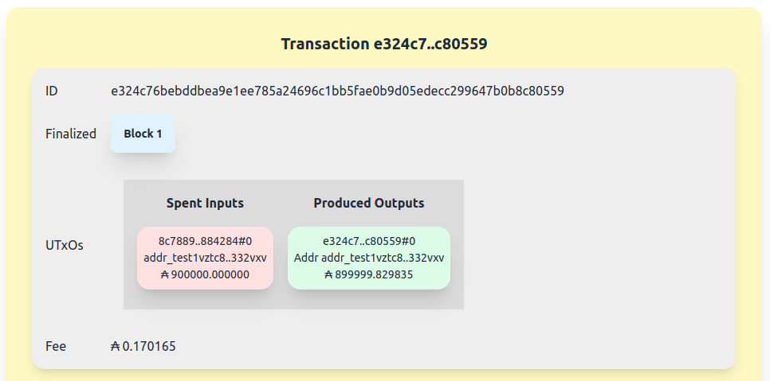

# Cardano Devnet

This repository enables anyone to create a completely local cardano development network that runs only on the development machine, with average block times that can be specified as a number of seconds, assignable from the command line.  This is useful if you want to experiment privately and locally, with an unlimited amount of tokens, without requiring network connectivity, and be able to discard the chain state once you're done with it.

It is recommended to use this with [cardano-cli-guru](https://github.com/iburzynski/cardano-cli-guru), a submodule under the [jambhala](https://github.com/iburzynski/jambhala) framework.

The project includes several additional features in addition to a locally running node:

* Live monitor - a terminal-based monitor script that shows high-level transaction information for the last confirmed transaction, as well as real-time pending transactions in the mempool.


* Lightweight indexer - a filesystem indexer built to store chain history in human-readable (json) format in a filesystem directory using symlinks where possible to optimize storage. This is perfect for development because you can start the devnet, run some tests, then stop the devnet and debug using the indexed database and built-in explorer.  This also allows you to peruse the database using standard filesystem cli tools.

```
$ cat db/transactions/41a818da0864ba9f4552af75c943b564870db652c99ea1e31d90e2745edb9b57/tx
{
  "id": "41a818da0864ba9f4552af75c943b564870db652c99ea1e31d90e2745edb9b57",
  "spends": "inputs",
  "fee": {
    "ada": {
      "lovelace": 358151
    }
  },
  "validityInterval": {},
  "signatories": [
    {
      "key": "330b6c126205329daef6a72d5381a2b55a8b002c1766487657f565c1e21f6ee2",
      "signature": "e5d63aa4f6941b242a4b104090cb41bb35cf6e8fd8f268e6b8e5bc85ce7a0e92c4723cb751e3cac4a8ded735411d89f3e996ac4e0774cfb062bf7844ece34003"
    }
  ],
  "producedHeight": 18,
  "inputs": [
    "25e01503dc6b053ef9863afb178b8232e14000b90745585e1464bdee238a71de#2",
    "517dbea6dd499d76506e66dae69ca05d4f1bf3d73a700c9e683a8939d11de5f0#0"
  ],
  "outputs": [
    "addr_test1vq44zlg5mj8cm5txeg4qgk2hn8k4j02uaxlf6u8p0dcmassfv4yfj",
    "addr_test1vpkqrr50xe8n473s6nz34xt76tx5h5uxgvfmuf75uk2k4lg4rpfa6",
    "addr_test1vpkqrr50xe8n473s6nz34xt76tx5h5uxgvfmuf75uk2k4lg4rpfa6"
  ]
}
```

* Web-based chain explorer - view blocks, transactions, spent and unspent utxos, address and token data from a web browser. Optionally specify the directory to use for the db - you can save previous chain states by moving the db directory somewhere and use this saved chain snapshot with the explorer anytime in the future.





* Lucid provider - a lucid provider that connects the client-side lucid api to the node backend. This is a direct replacement for the lucid blockfrost provider when using the preprod or mainnet networks. Allows developers to send transactions directly from javascript.

## Examples

In the examples directory, there are several examples of passing state through a sequence of transactions that demonstrate how multiple cardano transactions can be chained to pass a script state from one transaction to the next without requiring the previous transaction to be included in a block. The so-called [cardano eutxo bottleneck](https://builtoncardano.com/blog/concurrency-and-cardano-a-problem-a-challenge-or-nothing-to-worry-about) of one transaction per script address per block does not exist, provided there is a way to query the blockchain mempool.

Currenly only nodes that are block producers have access to the full network mempool, which means that stake pool operators could use a method such as the one demonstrated in this repository to offer a mempool query service to users as an additional way to provide value to the network.

## Usage

Follow the installation instructions, then starting the devnet is as easy as running the startup script:

```
$ start-cardano-devnet -mie 10
```

This will start the terminal monitor, filesystem indexer and web explorer with 10-second average block times. The terminal monitor will run in the terminal where you typed the command (make sure the window is wide enough!)

You can view the web explorer by navigating a browser to [http://localhost:5173](http://localhost:5173).

The startup script is self contained and the usage is as follows:

```
usage: start-cardano-devnet [-i] [-e] [-m] <block time>
  -i  run indexer
  -e  run explorer
  -m  run terminal monitor
```

Where ```<block time>``` is the target number of seconds between blocks. block time must be >= 1. This starts cardano-node locally and runs ogmios, which connects to the unix socket provided by cardano-node.  It then starts the optional components (indexer, explorer, monitor) as specified.

When the script exits it will kill all the processes automatically.


### Create some addresses (only with cardano-cli-guru set up during installation)

In a third terminal from this directory, run the key-gen command to generate two addresses:

```
$ key-gen alice
$ key-gen bob
```

### Transfer some funds from the faucet to alice (only with cardano-cli-guru set up):

```
$ utxos faucet
                           txhash                                 txix        amount
--------------------------------------------------------------------------------------
8c78893911a35d7c52104c98e8497a14d7295b4d9bf7811fc1d4e9f449884284     0        900000000000 lovelace + txoutdatumnone
$ transfer faucet alice 100 8c78893911a35d7c52104c98e8497a14d7295b4d9bf7811fc1d4e9f449884284#0 
```

You should see the transaction go into the mempool then eventually get included in a block.

### Try out the lucid transfer script to transfer from alice to bob:

```
$ node transfer.mjs alice bob 1.5
```

The lucid transfer script will query the monitor process for alice's current utxos and automatically
generate and sign the transaction. Note that any utxos in the mempool are included by the monitor
script as part of alice's utxos, which allows you to chain transactions rapidly even if they have 
not yet been included in a block!

### Check out the examples

The examples directory contains a few different examples of smart contracts that you can take a look at and use as a basis for other projects. If you build something useful for learning please consider contributing with a pull request!

### Check out the web explorer

Assuming you started both the indexer with the "-i" option, and the explorer with the "-e" option when running start-cardano-devnet, or alternatively you are running them separately using the ```indexer``` and ```explorer``` scripts in separate sessions, you should be able to connect to ```http://localhost:5173``` with a browser to explore the chain live as it runs.
